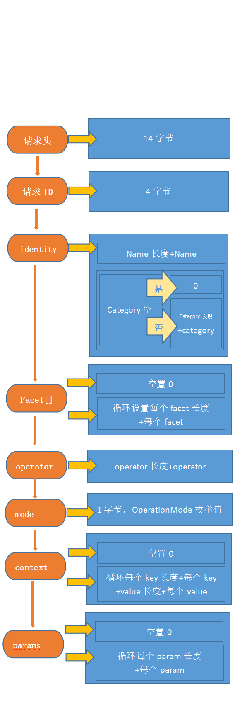
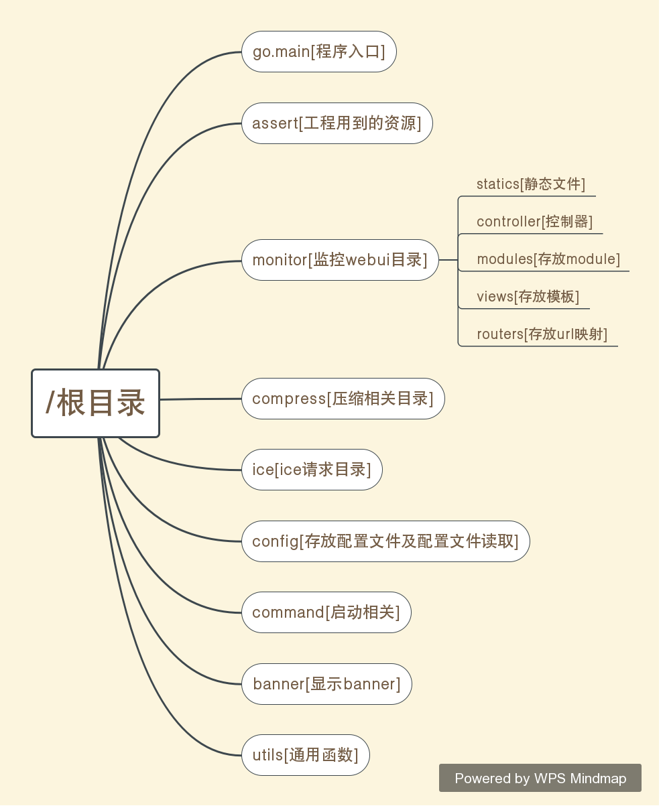

# 1、ice请求协议
ice协议相关文档见[https://doc.zeroc.com/ice/3.6/the-ice-protocol/](https://doc.zeroc.com/ice/3.6/the-ice-protocol/)
## 1.1、ice连接发需要发送一条消息，其实是把需要调用的ice服务类传到服务器上
协议格式如下：


| 属性          | 类型     | 长度(字节) | 说明                                                         |
| ------------- | -------- | ---------- | ------------------------------------------------------------ |
| HeaderData    | 结构体   | 14         | 定义请求头                                                   |
| requestId     | int      | 4          | 请求id，每个请求都有不同的id                                 |
| Ice::Identity | 结构体   | 不定       | 对象标识，该表示是指启动ice的时候定义好的，例如启动ice的时候定义为Identity id = Util.stringToIdentity("HelloIce"); |
| facet         | string[] | 不定       | ICE版本控制标识                                              |
| operation     | string   | 不定       | 方法名称                                                     |
| mode          | byte     | 1          | 模式，枚举值 OperationMode 这个枚举类中的                    |
| context       | map      | 不定       | 上下文，(string,string)hashmap                               |
| params        |          | 不定       | 请求参数                                                     |



```golang
struct HeaderData
{
    int  magic;
    byte protocolMajor;
    byte protocolMinor;
    byte encodingMajor;
    byte encodingMinor;
    byte messageType;
    byte compressionStatus;
    int  messageSize;
}
```
# 1.2、ice请求协议
```golang
struct HeaderData
{
    int  magic;
    byte protocolMajor;
    byte protocolMinor;
    byte encodingMajor;
    byte encodingMinor;
    byte messageType;
    byte compressionStatus;
    int  messageSize;
    int requestId;
}    

Identity
Facet
Operation
OperationMode
Context
RealDataSize
EncodingVersion
Params
```
## 1.3、压缩协议
具体见[https://doc.zeroc.com/ice/3.6/the-ice-protocol/protocol-compression](https://doc.zeroc.com/ice/3.6/the-ice-protocol/protocol-compression)关于压缩协议的介绍
压缩是Ice协议的可选功能; 是否用于特定消息取决于以下几个因素：
+ 并非所有平台或所有语言映射都支持压缩。
+ 仅当端点通知接受压缩消息的能力时，才能在请求或批处理请求中使用压缩。
+ 出于效率原因，Ice协议引擎不会压缩小于100字节的消息。
+ 协议的兼容实现可以自由地压缩小于100字节的消息 - 选择取决于协议实现。
如果使用压缩，则使用bzip2算法[1]压缩除头部之外的整个消息。因此，消息头的成员反映了压缩消息的大小，包括未压缩的头，加上另外四个字节。messageSize

- 特别说明：压缩可能仅在低速链路上提高性能，因为带宽是总体限制因素。在高速LAN链路上，压缩和解压缩消息所花费的CPU时间比发送未压缩数据所花费的时间长。也就是说如果带宽允许情况下尽量不使用压缩。
       
# 2、ice响应协议

| 属性          | 类型     | 长度(字节) | 说明                                                         |
| ------------- | -------- | ---------- | ------------------------------------------------------------ |
| HeaderData    | 结构体   | 14         | 定义响应头                                                   |
| requestId     | int      | 4          | 请求id，每个请求都有不同的id                                 |
| 响应状态码 | byte   | 1       | 响应状态码ReplyStatus |
| 整形后的数据长度 | byte   | 4       | 整形后的数据长度 |
| 编码主版本 | byte   | 1       | 编码版本 |
| 编码次版本 | byte   | 1       | 编码版本 |
| 最终数据长度         | byte或者byte+int | 1或者1+4       | 最终数据长度                                              |
| 最终数据     | string   | 不定       | 数据                                                     |


```
//写完上面的18字节
	// 接下来写 identity.name的长度（见BaseStream的WriteSize方法），接下来写identity.name
	// 接下来写 identity.category的长度（见BaseStream的WriteSize方法），接下来写identity.category（如果为空或者长度为零就不写）
	// Identity的name和category，本里中name=HelloIce,category为空，
	//写完这些数据后buf就有18+1+8+1+0=28字节
	//接下来下facet的，如果facet为空或者长度为0 就写一个为0（byte）的数据到buf后面；
	//如果不为空就封装成facet数组（数组长度为1），然后写数组长度到buf后面，然后循环写每个facet长度和当前facet
	//接下来写调用方法的长度和方法名称，本示例中调用sayHello方法，
	//接下来写一字节的OperationMode，
	//接下来写context的数据（就是指ice.ctx这个context），
	//如果context不为空就写context的size，然后遍历context中key和value，key、value都是字符串，也就是先写key的长度再写key
	//再写value的长度再写value，如此遍历直到遍历完整
	//context为空就读取内置的context（implicitContext，就是我们配置文件内些配置，比如说超时，比如说最大消息长度），
	// 见java代码OutgoingAsync中
	// Ice.ImplicitContextI implicitContext = ref.getInstance().getImplicitContext();
	//            java.util.Map<String, String> prxContext = ref.getContext()
	//如果 implicitContext为空就写 prxContent,否则就写implicitContext和prxContext合并的，但是实际上目前也是空的，。
	//接下来直接写个int 0；
	//

	//连接后发送 18个头，接下来 identity 18 + 1 + 8 + 1
	// + facet 1 = 29
	// + operator(ice_isA) + 1 + 7 = 37
	// + mode + 1 = 38
	// + context = 39
	// + int0 + 4 = 43
	// + encodingVersion + 1 +1 = 45
	// + ::service::HelloService = 45 + 1 + 23 = 69
	//为什么头会改变了呢
	//使用小端
```

# 3、goice目录结构图


参数列表
+ -OperateTimeout int类型，ice请求超时时间，单位秒
+ -ConnectTimeout int类型，ice连接超时时间，单位秒
+ -MessageMaxSize int类型，ice请求最大网络传输量，单位字节，超过此设置会分多条发送数据
+ -DefaultClientSize int类型，单个ice服务缺省连接数
+ -WarnClientSize int类型，单个ice服务连接数从低于此设置到超过此设置后会输出一条日志；从超过超过该设置到低于此设置也会输出一条日志
+ -MaxClientSize int类型，单个ice服务最大连接数
+ -Compress boolean类型[true，false]，是否要启用压缩，设置此值会消耗部分cpu资源，但是可以节省带宽，超过1000字节该设置才会生效
+ -RetryCount int类型，连接超时、执行超时重试次数
+ -MonitorPort int类型，web界面显示统计的端口，默认不开启，只有此设置后才开启
+ -Heartbeat int类型，心跳监测间隔时间，单位秒，默认3秒
+ -MaxIdleTime int类型，连接池连接最大保持时间时间，单位秒，默认300秒
+ -Balance int类型，负载均衡，1：随机，2：轮询，3：哈希，
+ -Report int类型，报警功能，0：不报警，1：邮件，2：短信，3：两者
+ -ConfigFile string，配置文件路径
+ 可以在启动的时候带上这些参数，这些参数将是优先级最高的
+ 参数优先级说明：最高优先级：启动的时候命令行所带参数；居中优先级：配置文件servers下面的参数；最低优先级：配置文件中default下面的参数

# 4、添加的新功能点:
- [x] 添加并发控制
- [x] 添加连接超时
- [x] 添加连接连接池及连接池中连接设置生存周期
- [x] 添加执行超时
- [x] 添加接受服务端返回的异常
- [x] 支持execute传入json或者Request请求接口
- [ ] 支持异步调用
- [x] 请求及相应统计（增加UI）
- [ ] 超时重连或者重新执行
- [ ] 加入心跳监测
- [ ] 支持在客户端对服务器负载均衡(也允许不配置负载均衡)
- [ ] 支持报警功能(报警邮件、短信等等)
- [x] 添加日志功能（本机日志，kafka）
- [x] 支持向后端传递ip及功能(放到context中，字段clientAddr)
- [x] 支持接口请求头功能
- [] 支持压缩功能（超过100字节压缩数据），使用bzip2压缩。不过压缩不是全平台及所有语言版本都支持，所以暂不实现了

    
# 5、便签记录
注意：不支持响应是自定义数据类型的请求，如果想要支持，需要自己写解析代码，要写到IceRequest.DoRequest(...)和IceBuffer.Prepare(...)方法中

记录下：
如果分析ice请求，我们可以开个java客户端去连接ice服务器端，
ice客户端请求出站一般看XXXPrxHelper,比如说我们测试的GoicePrxHelp,
然后在里面搜索我们测试的方法，就可以顺藤摸瓜找请求流程及编码方式了

如果要分析服务器端接受到请求执行完毕后需要如何编码数据，可以看 _XXXDisp,
我们开个ice服务器端，实现所有ice请求接口，
然后找到这个文件，搜索对应方法，就可以顺藤摸瓜找到如何编码结果的了，


ice服务器端（java）是通过nio实现的高并发的，它没有使用任何第三方nio包或者任何第三方其他包，
 
 
# 6、关于测试
- 特别说明，ice for java 在3.7以后的版本的包名及使用silec2java xxx.ice生成的代码有很大变动，原来包名是Ice,3.7以后是com.zeroc.Ice,不止是包名变动，api也大幅调整

| ice版本          | 操作系统及版本     | 测试结果 | 说明                                                         |
| ------------- | -------- | ---------- | ------------------------------------------------------------ |
| 3.7.2    | win7 64bit   | 通过         | 无                                                   |
| 3.6.4    | win7 64bit   | 通过         | 无                                                   |
| 3.5     | win7 64bit      |           |    无                              | 

测试方法，可在本地自己搭建，也可以直接放到docker中，测试的两个服务端节点和一个客户端节点运行在同一个主机上的三个不同容器中，

docker测试环境搭建方法：
> 只需要本工程下面的docker-compose.yaml文件，然后在运行了docker服务的主机上执行 docker-compose up即可看测试结果。

本地测试环境搭建方法：
- 1.在充当服务器的机器上安装jre8及以上（当然jdk也可以）
- 2.在充当客户端的机器上安装golang（推荐1.12以上）
- 3.在服务器上执行java -jar goice372.jar
- 4.把example/server/java/ice3.7.2/dockerfile/goice/goice372.jar保存到服务器上
- 5.把example/server/java/ice3.7.2/dockerfile/userpost/userpost372.jar保存到服务器上
- 6.把整个工程文件下载保存到客户端机器上
- 7.在服务器上执行java -jar userpost372.jar
- 8.在服务器上执行java -jar goice372.jar
- 9.在客户端机器上执行go build
- 10.在客户端机器上执行goice

